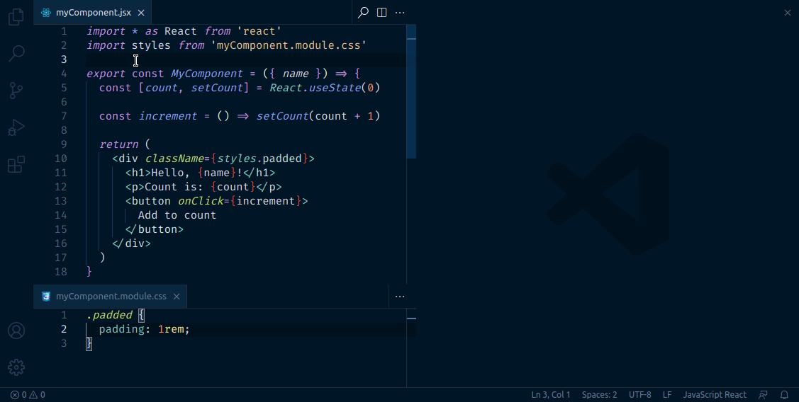
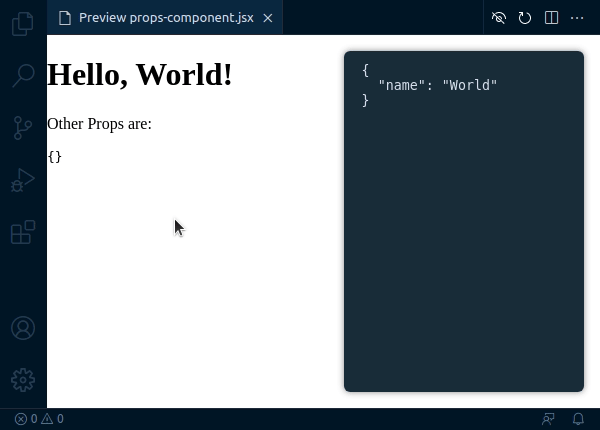

# Novella

Build UI components from the comfort of Visual Studio Code. View the UI component that you are working on side-by-side with its code.



## Prerequisites

You must have the following packages installed via a `node_modules` folder in the root of your project:

- react
- react-dom

## Project Config

Project-wide settings can be set in a `novella.config.js` file at the root of your project.

- `css` : An array of paths pointing to any css files that you want applied to the preview page
- `augment` : Let's you add extra plugins, globals, etc. for when Novella renders with esbuild
  - `plugins` : Any esbuild plugins to add
  - `globals` : Any global variables that need to be left alone when compiling

## Component Config

Each component have their own settings applied by creating a `file.novella.(j|t)sx` file next to the component.

For example:

```
src/components/SomeReallyCoolComponent.tsx
src/components/SomeReallyCoolComponent.novella.tsx
```

Component config includes the following properties:

- `wrapper` : A React component to wrap around the preview component. This is useful for components that need to be inside a context provider, or are only ever a child of certain other component.
- `props` : An object that describes the props to be passed to the preview component. Must be serializable as JSON. For function props, see the below section ':warning: Function Props'

### :warning: Non-serializable Props

Not all values are serializable to JSON, and so Novella has a to provide a special syntax to work around this, in the form of a `::tagname` tag appended to the prop name.

Available tags:

- `::function` : Converts the JSON value into a function that takes no arguments, and returns the JSON value `() => JSON_VALUE`
- `::date` : Converts the JSON value into a date by calling `new Date(JSON_VALUE)`

For example, the following component has the `user` function that provides an object with the name and age of the user, and so needs the `::function` tag. Similarly, it takes a `dob` prop that is a date, and so needs the `::date` tag.

```javascript
// Profile.jsx
import * as React from 'react'

export const Profile = ({ user, dob }) => {
  const { name, age } = user()

  return (
    <>
      <h1>Hello, {name}!</h1>
      <p>You appear to be {age} years old... Ouch</p>
      <p>You were born on: {dob.toISOString()}</p>
    </>
  )
}
```

This would require the following component config to work as expected:

```javascript
// Profile.novella.jsx
export default {
  props: {
    'user::function': {
      name: 'Octocat',
      age: 23,
    },
    'dob::date': '1987-21-04',
  },
}
```

## Props Panel

As part of opening the component preview, the props panel will also be displayed if there are any props defined in the `.novella.(j|t)sx` file. This will allow live-editing of the props, so that you can see how the component behaves with different props in real time.


The props panel can be resized horizontally by hovering the mouse over the left-hand edge, and clicking and dragging.


